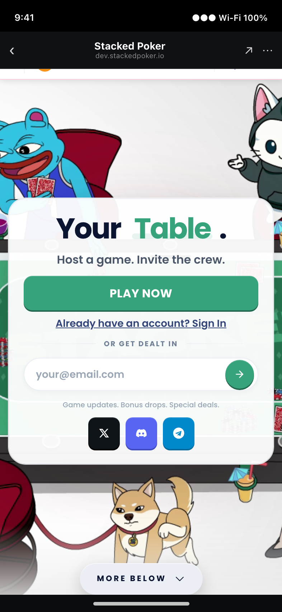
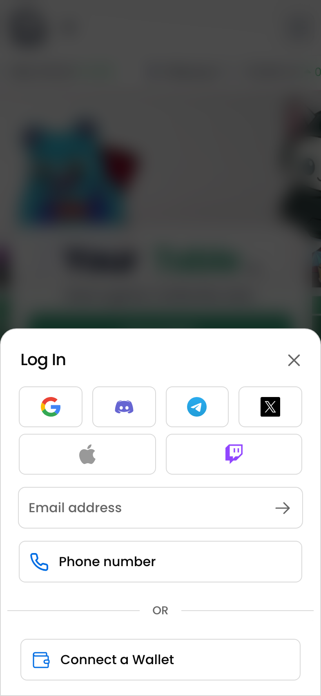
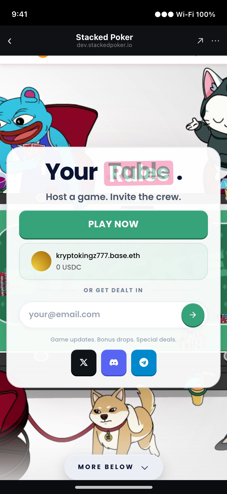
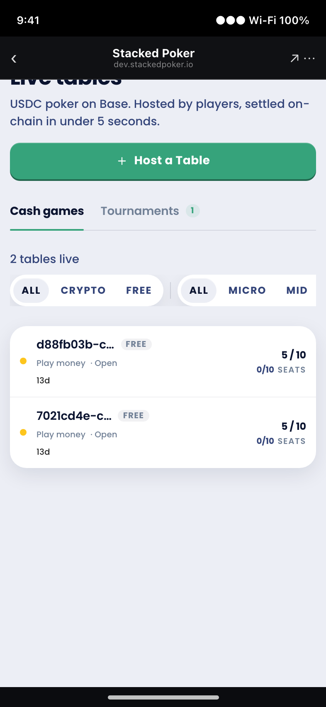

# Stacked Poker in the Base App — UI/UX Flow Review

**Date:** 2026-06-12 · **Reviewer:** Claude (Phase 2) · **Target:** `dev.stackedpoker.io` driven inside a simulated Base App shell.

> Context: the Base App became a **standard-web-app host on 2026-04-09** (it dropped Farcaster Mini Apps). So this review is about how our normal web app behaves for a user who opens it **from inside the Base App's in-app browser**, with their Base wallet already in hand. See the `base-miniapp-developer` skill and memory `project_base_app_miniapp_pivot`.

## How this was tested
- **In-repo shell:** `app/dev/base-shell/` renders the app inside Base App chrome (status bar + 96px app header + home indicator). It's a **visual harness only** — it does not inject a Base Account provider or test the real one-tap-login bridge. Gated behind `NEXT_PUBLIC_ENABLE_DEV_TOOLS` (not shipped to prod). Open `/dev/base-shell` (defaults to the same-origin local app; remote dev/prod needs a `frame-src` allowance — see Notes).
- **Fidelity caveat:** "works in the shell / works against dev.stackedpoker.io in a desktop Chromium" does **not** guarantee "works in the real Base App webview." Wallet UX, onramp, gestures, and notifications must be confirmed on-device.
- **Live drive:** Playwright drove the real `dev.stackedpoker.io` at an iPhone viewport with the Base App chrome injected as an overlay, authenticating through the repo's `?e2e_pk` path (connected as `kryptokingz777.base.eth`, SIWE succeeded).
- **Covered live:** cold open, marketing flip, login modal, authed landing, the `/public-games` lobby (cash + tournaments, with live table cards), and mobile-nav navigation.
- **Not covered live (reviewed from code):** in-table play, take-seat/buy-in, sharing, settlement — the dev lobby had no active games and I avoided mutating it.

---

## The journey, step by step

### 1. Cold open — two headers fighting for the top

- The Base App header (~96px) sits on top of the app, but the app **also** renders its own top nav (logo, theme toggle, hamburger) — so we have **double chrome** and the app's own nav is partially occluded. No `env(safe-area-inset-*)` handling.
- The first thing a Base App user sees is a **marketing landing** (hero art, "Your Table", email capture) — not poker. Inside the Base App the user has already "arrived"; this reads like a website, not an app.
- A **crypto price ticker** (BTC/ETH) sits under the header. It's noise for a poker player and odd inside a wallet that already shows prices.

**Fixes:** detect the in-app-browser/Base-Account context and render an app-first landing (skip the marketing hero, go straight to lobby/CTA); add safe-area padding; drop or hide the price ticker in-app; collapse our own top nav so it doesn't stack under the host header.

### 2. Login — the core problem (and the biggest opportunity)

A Base App user already holds their Base wallet. Yet the login modal leads with **Google, Discord, Telegram, X, Apple, Twitch, email, and phone**, and buries **"Connect a Wallet"** at the bottom under an "OR" — and that opens *yet another* picker (MetaMask/Coinbase/WalletConnect), still not a one-tap Base connection. This is the **exact opposite** of the goal.

**Fix (P0):** in the Base App context, replace this with **one tap** — detect the injected Base Account provider, bridge it through thirdweb `EIP1193.fromProvider` → set active → existing SIWE fires (mirror `app/components/E2EAutoConnect.tsx`). Suppress the social list there. Recipe: `references/base-app-integration.md`.

### 3. Authed landing — still a marketing page

After connecting (`kryptokingz777.base.eth / 0 USDC` chip appears), the user **still sees the marketing hero and the "OR GET DEALT IN" email-capture**. A logged-in player should land in the lobby or at a clear "join a game" surface, not a newsletter sign-up.

**Fix:** authed users (especially in-app) route straight to the lobby; hide marketing/email-capture for connected sessions.

### 4. Find / join a game — the lobby works; deep-link-to-seat is the gap

- **The lobby works.** It lives at **`/public-games`** (not `/games`) — `HTTP 200`, "Live tables", Cash/Tournaments tabs, stake filters (ALL/CRYPTO/FREE · MICRO/MID), and live table cards. The **mobile** "Public Games" button and desktop "Games" both link to it correctly (`HomeNavBar.tsx:60`, `:324`) — verified by navigating live. (My earlier "404 / route confusion" note used guessed URLs and was wrong — disregard it.)
- **The real gap: no deep-link-to-seat, and the share card is generic.** The table route (`app/table/[id]`) reads no `searchParams`, so a shared `/table/[id]` link can't auto-open the take-seat sheet. And `generateMetadata` *exists* at `app/table/[id]/page.tsx:10` but is **static/generic** — the same title + `table_preview.png` for every table, with no `fc:miniapp` embed. So a shared link both lands the user as a spectator who must find a seat *and* unfurls as a bland card. The fix is to **enrich** the existing OG (live table data + per-table image + `fc:miniapp` embed) and add a `?join=1` handler.
- Note: even on this working lobby, the page's own "Live tables" heading is clipped under the Base App header — reinforces the §1 double-header / safe-area issue.

**Fix (P1):** per-table OpenGraph in `app/table/[id]` (rich unfurl in Base App chats) + a join-intent param (e.g. `/table/<id>?join=1`) that auto-opens the take-seat sheet on arrival. `references/navigation-share-notify.md`.

### 5. In-table (code-grounded)
- Hard reloads on tournament table-moves and reconnects (`WebSocketProvider.tsx:869`, `ConnectionLostToast.tsx`, `WalletChangeReloader.tsx`) tear down the in-app session and re-trigger the host splash — jarring in a webview. Convert to client navigation/state refresh.
- The drag-heavy felt + react-three canvas can collide with the host's back/dismiss gestures.
- Keep the USDC ERC-20 paymaster (EIP-5792 `wallet_sendCalls`) — the Base App does **not** auto-sponsor our contract calls. `references/paymaster.md`.

### 6. Share / invite (code-grounded)
- Invites/links use `window.open`/`window.location` to X/Telegram and copy `window.location.href` (`LobbyBanner.tsx:52`, `ShareRankCard.tsx`, `useConnectX.ts`). Route everything through one `ExternalLink` chokepoint with `window.open`, and build sharing around the per-table URL so "send the link, play instantly" actually works in Base App chat.

### 7. Live content/brand issues surfaced during the walkthrough
- The FAQ names our vendor in player copy: *"We use **Thirdweb** to make connecting simple…"* — violates `poker-docs/STYLE.md` (Technical exposure) and `CLAUDE.md` (don't name vendors).
- The FAQ uses the **killed term "Banker"**: *"How does the 'Banker' system work…"* — `CLAUDE.md` says never use "Banker" in player-facing copy.
- (Both are on the live marketing/FAQ surface, independent of the Base App work, but worth fixing.)

---

## Prioritized fixes

| Pri | Fix | Where |
|----|-----|-------|
| **P0** | One-tap Base-wallet login (bridge injected Base Account → thirdweb → SIWE); suppress social list in-app | `references/base-app-integration.md` |
| **P0** | App-first landing for in-app/authed users (skip marketing hero → lobby); safe-area insets; tame double header | §1, §3 |
| **P1** | Per-table OpenGraph + working `?join=1` deep-link → auto take-seat | `references/navigation-share-notify.md` |
| **P1** | Replace `window.open`/hard reloads with `ExternalLink` chokepoint + client navigation | §5, §6 |
| **P2** | "Your table is starting" via Base Dashboard Notifications API (wallet-keyed) | `references/navigation-share-notify.md` |
| **P2** | Hide crypto price ticker in-app; copy fixes ("Thirdweb", "Banker") | §1, §7 |
| **P2** | Backend: confirm deployed-CBSW SIWE on Base Sepolia; handle undeployed-CBSW first login | `references/base-app-integration.md` |

## Notes / artifact
- **Shell route:** `app/dev/base-shell/page.tsx`. Open `/dev/base-shell` to navigate the app inside Base App chrome. Defaults to the same-origin local app (CSP-safe). To frame the remote dev/prod site, add `https://dev.stackedpoker.io https://stackedpoker.io` to `frame-src` in `next.config.js` (a `/dev`-scoped header is cleaner so prod CSP is untouched) — not done here to avoid changing prod config.
- Screenshots in `screenshots/` were captured against `dev.stackedpoker.io` on 2026-06-12.
- The shell is a *simulation* — it can't replicate the real Base App's wallet UX, onramp, or notifications. Finish with an on-device pass (`references/testing-simulation.md`).
